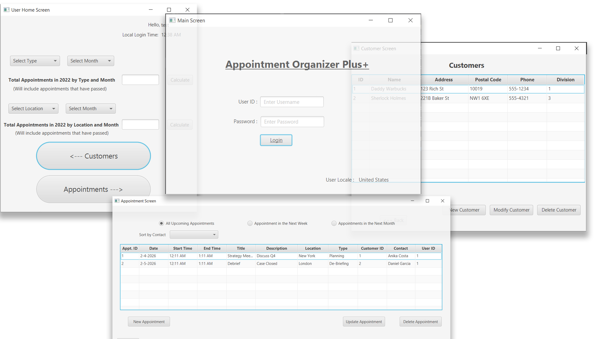

# 📅 Client Schedule App (JavaFX)

A comprehensive GUI-based scheduling application designed to manage customer appointments across multiple time zones. This desktop application features a multi-lingual login interface, automated time-zone conversions, and robust input validation.

## 🚀 Key Features
* **Time Zone Awareness:** Automatically converts appointment times between the database (UTC), the user's local system time, and the company's business hours (EST) to prevent scheduling conflicts.
* **Localization (I18N):** Detects the user's system language (English/French) and translates the login interface and error messages automatically using Resource Bundles.
* **Reporting Dashboard:** Generates dynamic reports for appointment totals by type/month and schedules for individual contacts.
* **Input Validation:** Prevents overlapping appointments and ensures data integrity before writing to the database.

## 🛠 Tech Stack
* **Language:** Java 17
* **GUI Framework:** JavaFX (Modular SDK)
* **Database:** MySQL 8.0
* **Build Tool:** Maven
* **ORM:** JDBC (Direct SQL connectivity)

## ⚙️ How to Run This Project

### Prerequisites
* **Java JDK 17** or higher
* **MySQL Server** (Running on localhost:3306)
* **Maven** (Integrated into IntelliJ IDEA)

### 1. Database Setup
This application requires a local MySQL database.
1.  Open your MySQL client (Workbench, Command Line, etc.).
2.  Run the provided script: `client_schedule.sql` (located in the root folder).
    * *This script creates the `client_schedule` database, tables, and populates dummy data.*
3.  **Default Database Configuration:**
    * The app is configured to connect with User: `root` and Password: `root`.
    * *Note: If your local MySQL password differs, update the credentials in `src/main/java/database/JDBC.java` before running.*

### 2. Launching the App
1.  Clone the repository and open in **IntelliJ IDEA**.
2.  Let Maven download dependencies (Auto-sync).
3.  **Build the Project:** Open the Maven sidebar, run `clean`, then `install`.
4.  **Run:** Execute the `Launcher.java` file (located in `src/main/java/main`).

### 3. Login Credentials
Once the app launches, use the following test credentials:
* **Username:** `test`
* **Password:** `test`

## 🧠 Technical Highlights

### Lambda Expressions
This project utilizes lambda expressions to improve code readability and efficiency.
* **Time Management:** Used for cleaner filtering of appointment times against business hours.
* **Alert Handling:** Simplified the code required to trigger popup alerts for validation errors.

### Multithreading Note
Database operations are handled via standard JDBC calls. While this version runs on the main thread for simplicity (typical for academic requirements), a production version would utilize `Task<T>` or `CompletableFuture` to prevent UI freezing during queries.

---
*Created as part of the WGU Software II (C195) curriculum.*